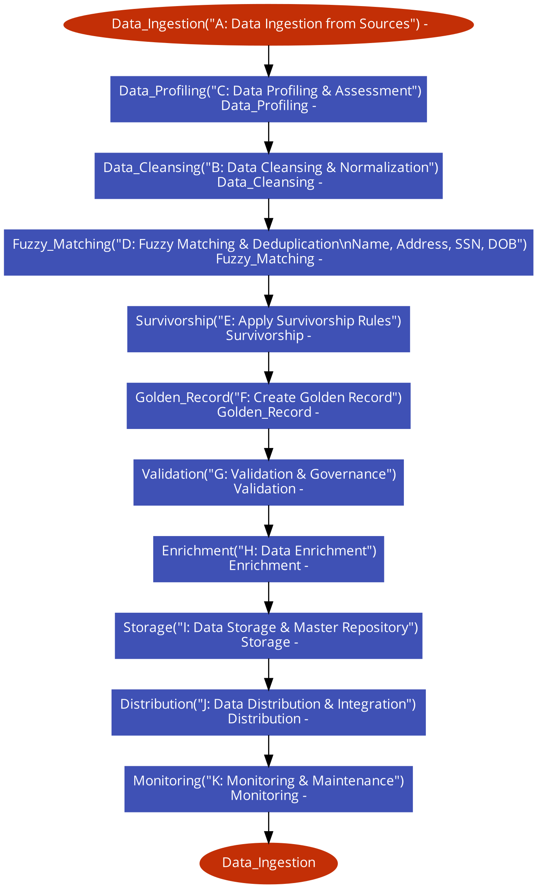

## steps to create flowchart

### Create content as text

```
# Master Data Management (MDM) Tool Flowchart

Data_Ingestion("A: Data Ingestion from Sources") -> Data_Profiling("C: Data Profiling & Assessment")
Data_Profiling -> Data_Cleansing("B: Data Cleansing & Normalization")
Data_Cleansing -> Fuzzy_Matching("D: Fuzzy Matching & Deduplication\nName, Address, SSN, DOB")
Fuzzy_Matching -> Survivorship("E: Apply Survivorship Rules")
Survivorship -> Golden_Record("F: Create Golden Record")
Golden_Record -> Validation("G: Validation & Governance")
Validation -> Enrichment("H: Data Enrichment")
Enrichment -> Storage("I: Data Storage & Master Repository")
Storage -> Distribution("J: Data Distribution & Integration")
Distribution -> Monitoring("K: Monitoring & Maintenance")
Monitoring -> Data_Ingestion
```

### copy it and visit https://app.code2flow.com/ and paste it there

### downoad flowchart as PNG


